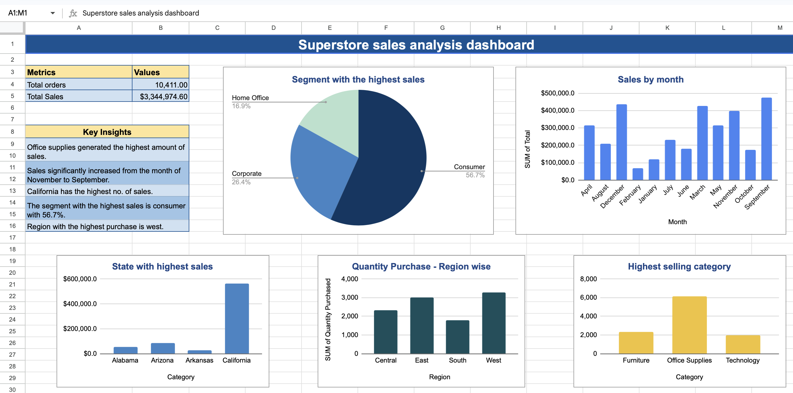
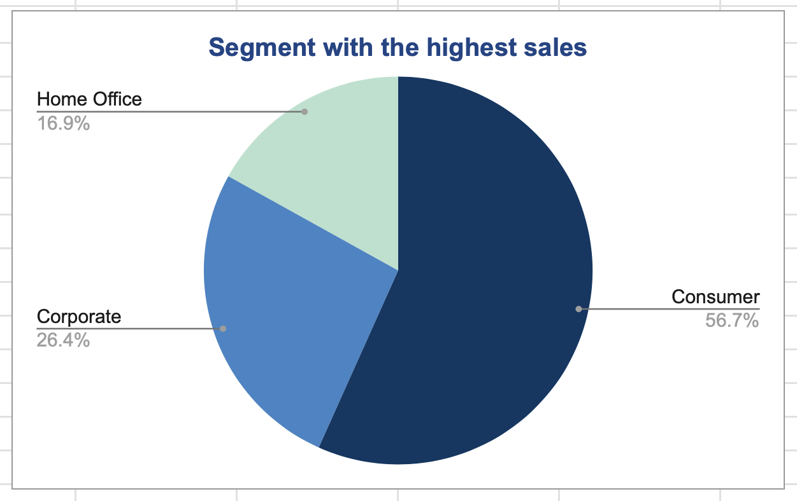
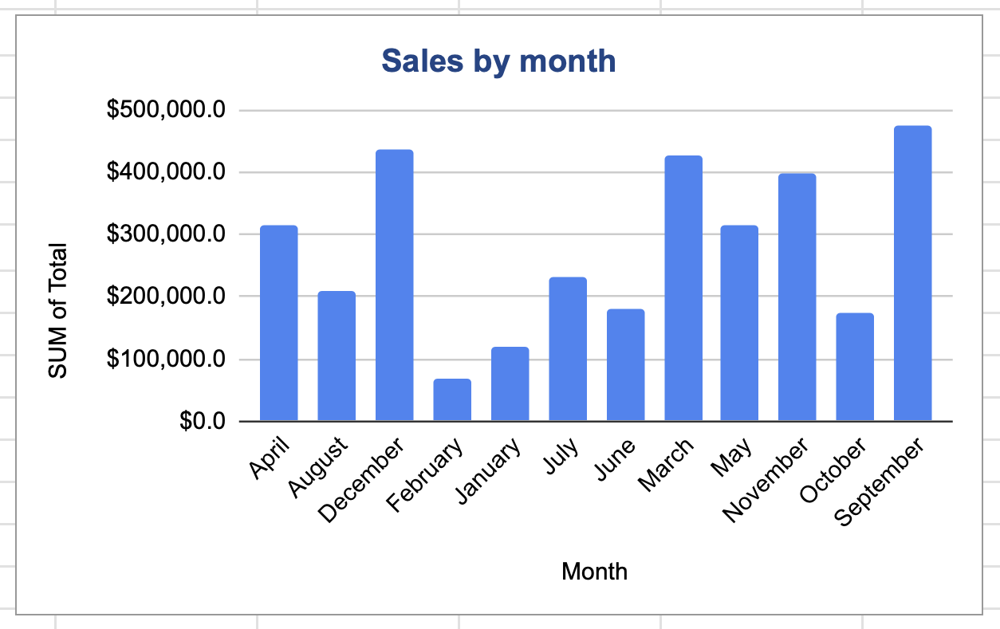
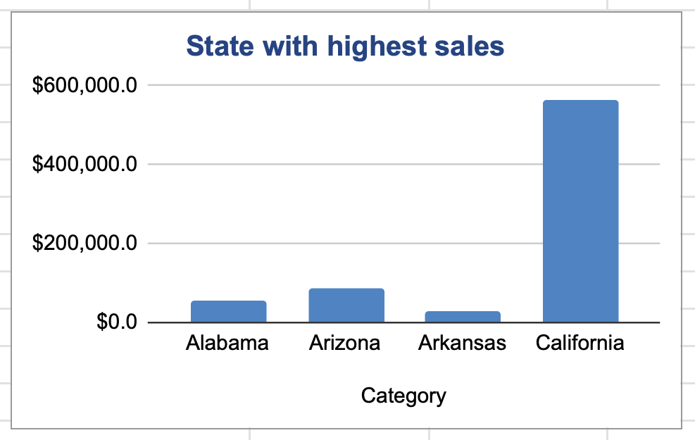
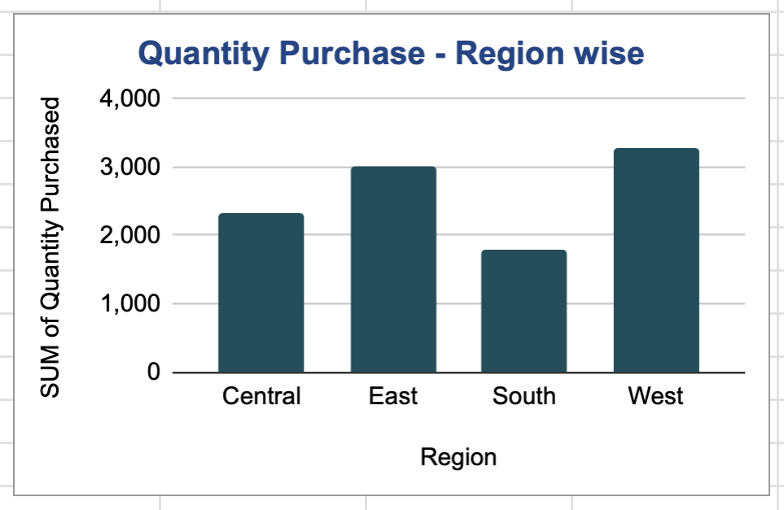
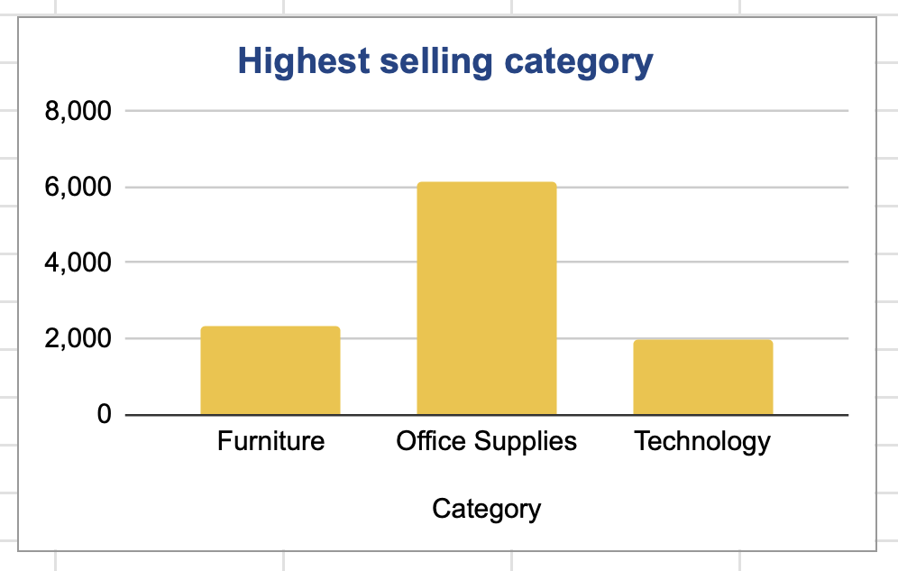
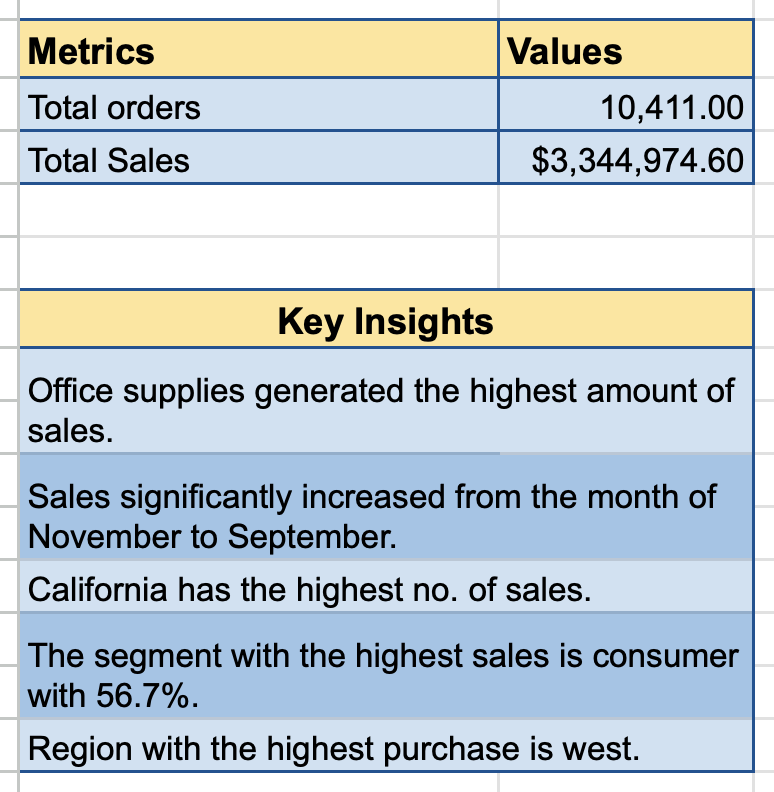

## 🛒 Superstore Sales Data Analysis (Excel Dashboard)

---

### 📊 Overview
This project analyzes Superstore sales data to uncover key business insights related to sales performance across different segments, regions, categories, and time periods. An interactive dashboard was created using Microsoft Excel to visualize trends and support data-driven decision-making.

---

### 🔗 Live Dashboard
[Click here to view the project on Google Sheets]
(https://docs.google.com/spreadsheets/d/1dSjIHPgu-u_hPamaZrc4HcFLsPNBXjY-8zD1Ihz5UvM/edit?usp=sharing)

---

### 🗂 Dataset Description
The dataset contains transactional sales data of a retail superstore, including:

- Order details (Order ID, Date)
- Sales amount
- Product category (Furniture, Office Supplies, Technology)
- Customer segment (Consumer, Corporate, Home Office)
- Region and State
- Quantity purchased

---

### 🛠 Tools Used
- Microsoft Excel  
- Pivot Tables  
- Charts & Data Visualization  

---

### 🔍 Key Analysis Performed
- Analyzed total orders and overall sales performance  
- Segmented sales by customer category  
- Evaluated monthly sales trends  
- Compared regional performance based on quantity purchased  
- Identified top-performing states and product categories  
- Built an interactive dashboard for easy interpretation  

---

### 📈 Key Insights
- **Consumer segment** contributes the highest share of sales (~56.7%)  
- **Office Supplies** is the top-performing product category  
- **California** generates the highest sales among states  
- **West region** has the highest quantity of purchases  
- Sales show strong fluctuations across months, with peak performance in selected months  
- Overall sales exceed **$3.3M** with more than **10,000 orders**

---

### 📸 Dashboard Preview

---

### 📊 Visual Insights

#### 📍 Sales by Segment
- Consumer dominates sales contribution
- 

#### 📅 Sales by Month
- Identifies seasonal trends and peak months
- 

#### 🗺 Sales by State
- Highlights top-performing states
- 

#### 🌍 Region-wise Quantity
- Compares purchasing patterns across regions
- 

#### 📦 Category Performance
- Shows which category has the hightest no. of sales 
- 

#### 📦 Useful Insights
- Key readings of the dashboard
- 
- 
---

### 🚀 Conclusion
This project demonstrates the ability to analyze retail sales data using Excel and present insights through a well-structured dashboard. It highlights how segmentation and visualization can help businesses understand performance and optimize strategy.

---

### 📌 Skills Demonstrated
- Data Analysis  
- Data Cleaning  
- Data Visualization  
- Dashboard Creation  
- Business Insight Generation  

